# what the fuzz


## Overview

**what the fuzz** or **wtf** is a distributed, code-coverage guided, customizable, cross-platform snapshot-based fuzzer designed for attacking user and or kernel-mode targets running on Microsoft Windows. Execution of the target can be done inside an emulator with [bochscpu](https://github.com/yrp604/bochscpu) (slowest, most precise), inside a Windows VM with the [Windows Hypervisor Platform APIs](https://docs.microsoft.com/en-us/virtualization/api/hypervisor-platform/hypervisor-platform) or inside a Linux VM with the [KVM APIs](https://www.kernel.org/doc/html/latest/virt/kvm/api.html) (fastest).

<p align='center'>
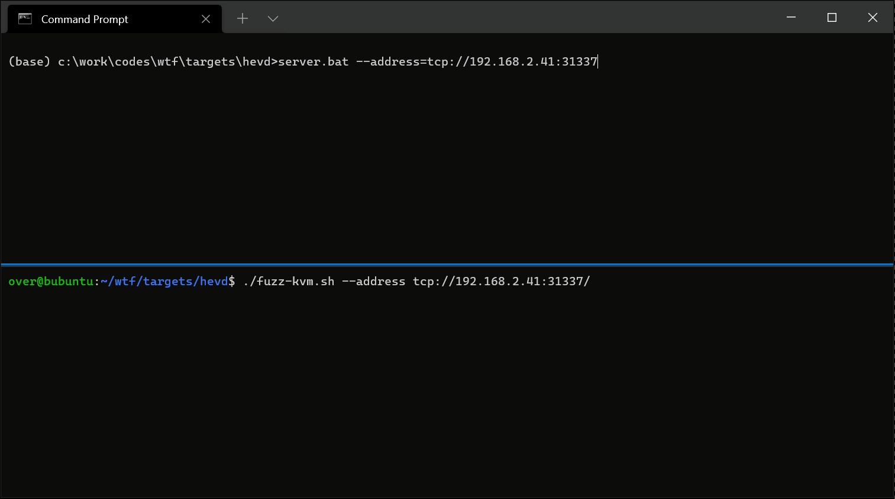
</p>

It uncovered memory corruption vulnerabilities in a wide range of softwares: [IDA Pro](https://github.com/0vercl0k/fuzzing-ida75), a popular [AAA game](https://blog.ret2.io/2021/07/21/wtf-snapshot-fuzzing/), the [Windows kernel](https://microsoft.fandom.com/wiki/Architecture_of_Windows_NT), the [Microsoft RDP client](https://www.hexacon.fr/slides/Hexacon2022-Fuzzing_RDPEGFX_with_wtf.pdf), [NVIDIA GPU Display driver](https://nvidia.custhelp.com/app/answers/detail/a_id/5383), etc.

Compiled binaries are available from either the [CI artifacts](https://github.com/0vercl0k/wtf/actions/workflows/wtf.yml) or from the [Releases](https://github.com/0vercl0k/wtf/releases) section for both Windows & Linux.

If you would like to read more about its history or how to use it on a real target, I recommend to take a look at those posts to get started 🔥
- [Building a new snapshot fuzzer & fuzzing IDA](https://doar-e.github.io/blog/2021/07/15/building-a-new-snapshot-fuzzer-fuzzing-ida/)
- [Fuzzing Modern UDP Game Protocols With Snapshot-based Fuzzers](https://blog.ret2.io/2021/07/21/wtf-snapshot-fuzzing/) by [Markus Gaasedelen](https://twitter.com/gaasedelen)
- [Fuzzing RDPEGFX with "what the fuzz"](https://thalium.github.io/blog/posts/rdpegfx/) by [Colas Le Guernic](https://github.com/clslgrnc), Jérémy Rubert, and Anonymous
- [A Journey to Network Protocol Fuzzing – Dissecting Microsoft IMAP Client Protocol](https://www.fortinet.com/blog/threat-research/analyzing-microsoft-imap-client-protocol) by [Wayne Chin Yick Low](https://www.fortinet.com/blog/search?author=Wayne+Chin+Yick+Low)

Special thanks to [@yrp604](https://github.com/yrp604) for providing valuable inputs throughout the project and [@masthoon](https://github.com/masthoon) for suggesting to write a demo targeting [HEVD](https://github.com/hacksysteam/HackSysExtremeVulnerableDriver) secure mode.

## Usage

The best way to try the features out is to work with the [fuzzer_hevd](src/wtf/fuzzer_hevd.cc) / [fuzzer_tlv_server](src/wtf/fuzzer_tlv_server.cc) modules. You can grab the [target-hevd.7z](https://github.com/0vercl0k/wtf/releases) / [target-tlv_server.7z](https://github.com/0vercl0k/wtf/releases) archives and extract them into the `targets/` directory. The archives contain the directory trees that are expected for every targets:

- `inputs` is the folder where your input test-cases go into,
- `outputs` is the folder where the current minset files are saved into,
- `coverage` is the folder where the `.cov` files are expected to be in,
- `crashes` is where the crashes gets saved in,
- `state` is where the memory dump (`mem.dmp`) as well as the CPU state (`regs.json`) and the symbol store are stored in (`symbol-store.json`). The symbol store is a simple JSON file that is used on Linux systems to know where to put breakpoints as there is no support for symbols / dbgeng on those platforms. *wtf* generates this file at runtime everytime you run your target on Windows.

### Starting a server node

The server is basically the brain and keeps track of all the state: the aggregated code-coverage, the corpus, it generates and distributes the test-cases to client.

This is how you might choose to launch a server node:

```text
(base) c:\work\codes\wtf\targets\hevd>..\..\src\build\wtf.exe master --max_len=1028 --runs=10000000 --target . --address tcp://192.168.2.41/ --name hevd
```

The `max_len` option is used to limit the size of the generated test-case, `runs` is the number of test-cases it will generate, `address` specify where *wtf* needs to be listening on, `target` is a directory with the directory tree we described above (the user can also choose to override those directories with `--input` / `--output` / `--crashes`) and `name` specifies your  fuzzing module name so that the master can invoke your generator function if you have defined one.

<p align='center'>
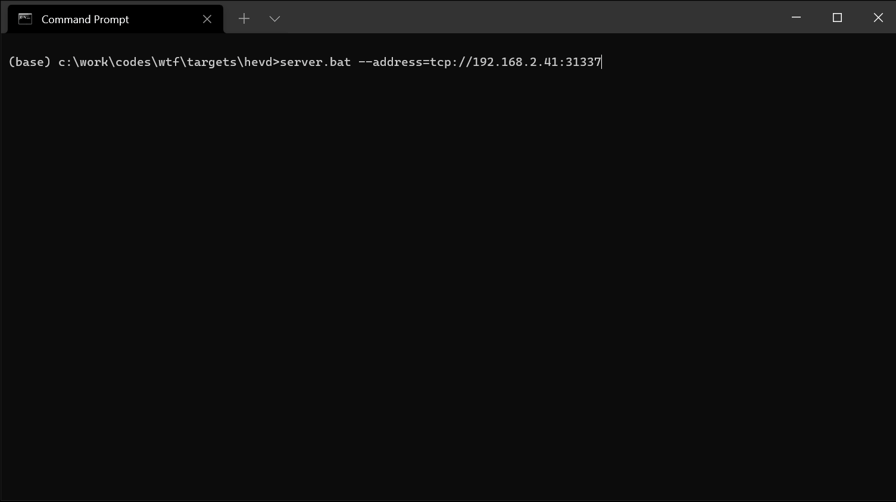
</p>

### Fuzzing nodes

The client nodes run a test-case that has been generated and distributed by the server and communicates the result back to the server (code-coverage, result, etc.).

This is how you would start a client node that uses the *bochscpu* backend:

```text
..\..\src\build\wtf.exe fuzz --backend=bochscpu --name hevd --limit 10000000
```

The `fuzz` subcommand is used with the `name` option to specify which fuzzer module needs to be used, `backend` specifies the execution backend and `limit` the maximum number of instruction to execute per testcase (depending on the backend, this option has different meaning).

<p align='center'>
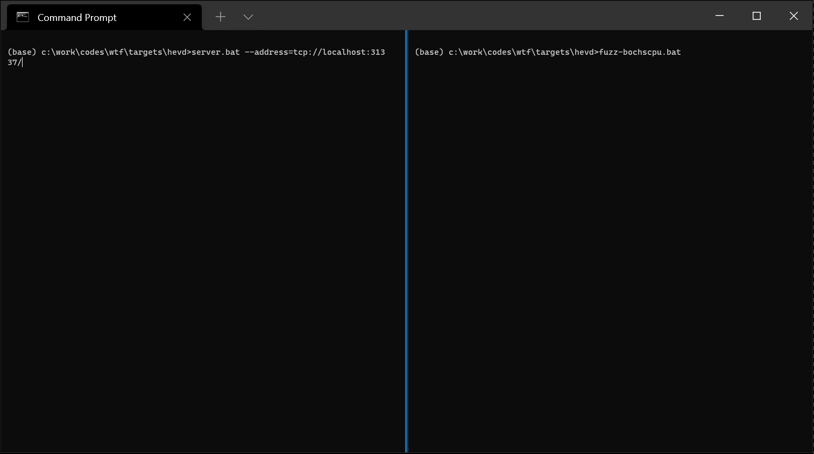
</p>

### Running a test-case

If you would like to run a test-case (or a folder filled with test-cases), you can use the `run` subcommand.

This is how you would would run the `crash-0xfffff764b91c0000-0x0-0xffffbf84fb10e780-0x2-0x0` test-case:

```
..\..\src\build\wtf.exe run --name hevd --state state --backend=bochscpu  --limit 10000000 --input crashes\crash-0xfffff764b91c0000-0x0-0xffffbf84fb10e780-0x2-0x0
```

<p align='center'>
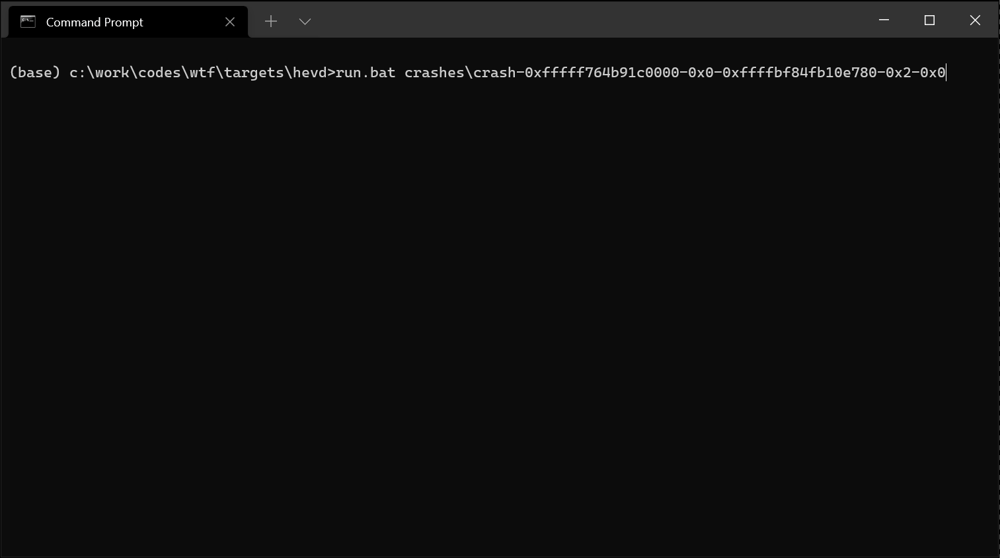
</p>

### Minseting a corpus

To minset a corpus, you need to use a server node and as many client nodes as you need like you would for a fuzzing job. You can simply set the `runs` optins to 0.

This is how you would minset the corpus in `outputs` into the `minset` directory (also highlights how you can override the `inputs` and `outputs` directories):

```
..\..\src\build\wtf.exe master --max_len=1028 --runs=0 --target . --inputs=outputs --outputs=minset
```

<p align='center'>
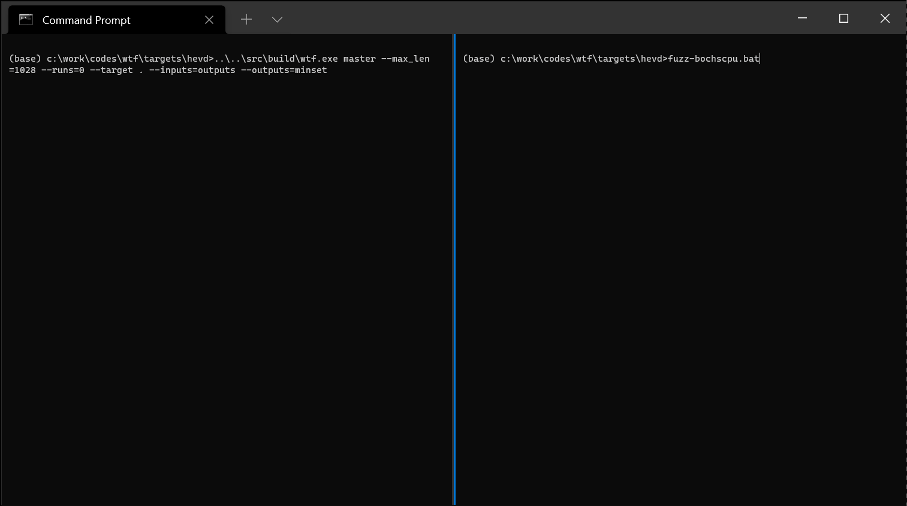
</p>

### Generating execution traces

The main mechanism available to instrospect in an execution backend is to generate an execution trace. *bochscpu* is the only backend that has the ability to generate a complete execution traces so it is best to use for debugging purposes. The other backends only generate execution traces used to measure code-coverage (address of the first instruction in a basic block).

This is how you would generate an execution trace for the `crash-0xfffff764b91c0000-0x0-0xffffbf84fb10e780-0x2-0x0` test-case:

```
..\..\src\build\wtf.exe run --name hevd --state state --backend=bochscpu  --limit 10000000 --input crashes\crash-0xfffff764b91c0000-0x0-0xffffbf84fb10e780-0x2-0x0 --trace-type=rip
```

<p align='center'>
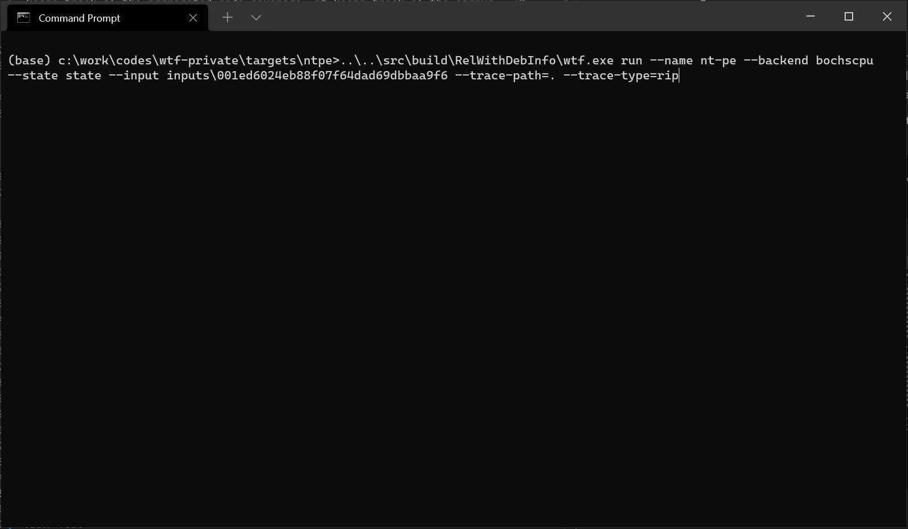
</p>

The execution traces aren't symbolized because Linux systems wouldn't be able to do that and that is why I wrote [symbolizer](https://github.com/0vercl0k/symbolizer).

This is how you would symbolize the `crash-0xfffff764b91c0000-0x0-0xffffbf84fb10e780-0x2-0x0.trace` execution trace generated above:

```
symbolizer.exe --input crash-0xfffff764b91c0000-0x0-0xffffbf84fb10e780-0x2-0x0.trace --crash-dump state\mem.dmp
```

<p align='center'>
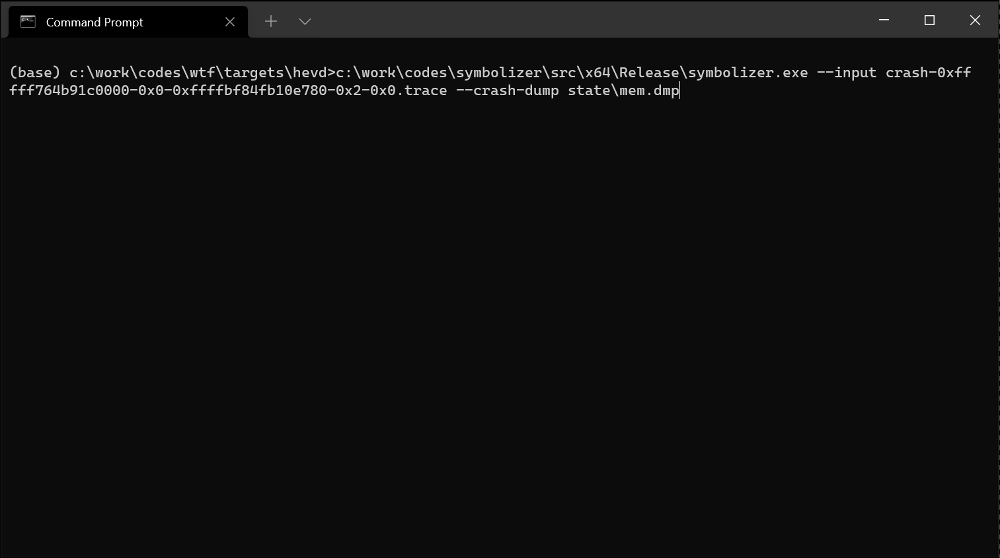
</p>

## Generating Tenet traces

If you see yourself needing more contextual awareness, the *bochscpu* backend allows you to generate execution traces that can be loaded in the [Tenet](https://github.com/gaasedelen/tenet) trace explorer. In the below, I start from a crash in `memmove` and walk back to find out where the source pointer is coming from (user-mode!):

```
..\..\src\build\wtf.exe run --name hevd --state state --backend=bochscpu  --limit 10000000 --input crashes\crash-0xfffff764b91c0000-0x0-0xffffbf84fb10e780-0x2-0x0 --trace-type=tenet
```


<p align='center'>
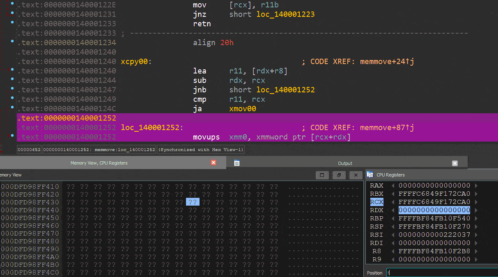
</p>

### Generating code-coverage traces

To generate code-coverage traces you can simply use the `run` subcommand with the `--trace-type=cov` option.

This is how you would generate code-coverage traces for all the files inside the `minset` folder and store them in the `coverage-traces` folder:

```
..\..\src\build\wtf.exe run --name hevd --state state --backend=whv --input minset --trace-path=coverage-traces --trace-type=cov
```

<p align='center'>
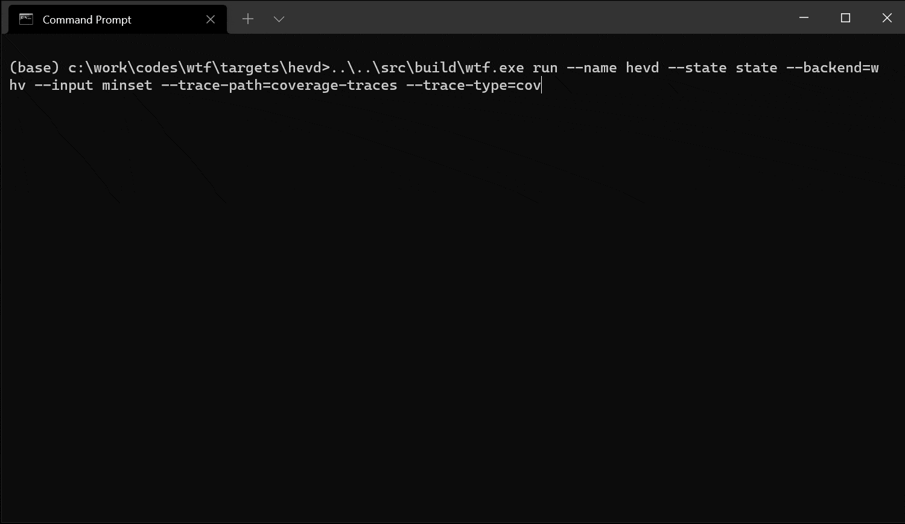
</p>

Those traces aren't directly loadable into [lighthouse](https://github.com/gaasedelen/lighthouse) because they aren't symbolized.

This is how you would symbolize all the files inside the `coverage-traces` folder and write the results into `coverage-traces-symbolized`:

```
symbolizer.exe --input coverage-traces --crash-dump state\mem.dmp -o coverage-traces-symbolized --style modoff
```

<p align='center'>
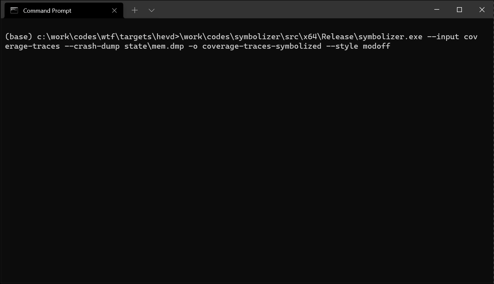
</p>

And finally, you can load those up in [lighthouse](https://github.com/gaasedelen/lighthouse):

<p align='center'>
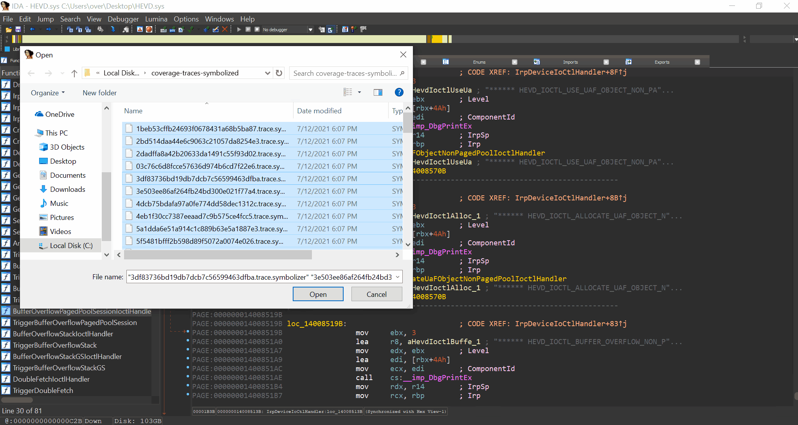
</p>

Also if you don't care about individual code-coverage, the master maintains a `coverage.cov` file contains the unique aggregated code-coverage that has been exercised. It makes it easy to check on the global code-coverage really quick during a fuzzing job. 

## How does it work?

*wtf* runs user & kernel mode through an *execution backend* and relies on the user to insert test-cases in the target. Unlike other classical fuzzer tools, *wtf* doesn't do much of the heavy lifting; the user does. The user needs to know the harnessed target very well and onboarding a target is an iterative process that will take time. It has a lot of flexibility to offer if you are ready to get hacking though :)

The usual workflow to harness a target is as follows:

1. Get your target running into a Hyper-V VM running Windows with one virtual CPU and 4GB of RAM.
1. Put your target into the desired state using [KD](https://docs.microsoft.com/en-us/windows-hardware/drivers/debugger/). For example, to target [HEVD](https://github.com/hacksysteam/HackSysExtremeVulnerableDriver)'s IOCTL handler, I chose to stop the target in user-mode right before the client invokes [DeviceIoControl](https://docs.microsoft.com/en-us/windows/win32/api/ioapiset/nf-ioapiset-deviceiocontrol). This will vary depending on your targets but you probably want it to be close to the code you want to fuzz.

    ```
    kd> r
    rax=000000dfd98ff3d0 rbx=0000000000000088 rcx=0000000000000088
    rdx=00000000deadbeef rsi=0000000000000000 rdi=0000000000000000
    rip=00007ff6f5bb111e rsp=000000dfd98ff380 rbp=0000000000000000
    r8=000000dfd98ff3d0  r9=0000000000000400 r10=000002263e823055
    r11=00007ff6f5bcb54d r12=0000000000000000 r13=0000000000000000
    r14=0000000000000000 r15=0000000000000000
    iopl=0         nv up ei pl nz na po nc
    cs=0033  ss=002b  ds=002b  es=002b  fs=0053  gs=002b             efl=00000206
    hevd_client!main+0xae:
    00007ff6`f5bb111e ff15dc1e0100    call    qword ptr [hevd_client!_imp_DeviceIoControl (00007ff6`f5bc3000)] ds:002b:00007ff6`f5bc3000={KERNEL32!DeviceIoControlImplementation (00007ff8`3e2e6360)}
    ```

1. Use [bdump.js](https://github.com/yrp604/bdump) to generate the kernel crash-dump as well as the `regs.json` file that contains the CPU state. I recommend to dump those file in a `state` directory under your `target` directory (`targets/hevd/state` for example):

    ```
    kd> .scriptload c:\\work\\codes\\bdump\\bdump.js
    [bdump] Usage: !bdump "C:\\path\\to\\dump"
    [bdump] Usage: !bdump_full "C:\\path\\to\\dump"
    [bdump] Usage: !bdump_active_kernel "C:\\path\\to\\dump"
    [bdump] This will create a dump directory and fill it with a memory and register files
    [bdump] NOTE: you must include the quotes and escape the backslashes!
    JavaScript script successfully loaded from 'c:\work\codes\bdump\bdump.js'

    kd> !bdump_active_kernel "c:\\work\\codes\\wtf\\targets\\hevd\\state"
    [bdump] creating dir...
    [bdump] saving regs...
    [bdump] register fixups...
    [bdump] don't know how to get mxcsr_mask or fpop, setting to zero...
    [bdump]
    [bdump] don't know how to get avx registers, skipping...
    [bdump]
    [bdump] tr.base is not cannonical...
    [bdump] old tr.base: 0x7375c000
    [bdump] new tr.base: 0xfffff8047375c000
    [bdump]
    [bdump] setting flag 0x2000 on cs.attr...
    [bdump] old cs.attr: 0x2fb
    [bdump] new cs.attr: 0x22fb
    [bdump]
    [bdump] rip and gs don't match kernel/user, swapping...
    [bdump] rip: 0x7ff6f5bb111e
    [bdump] new gs.base: 0xdfd9621000
    [bdump] new kernel_gs_base: 0xfffff8046b6f3000
    [bdump]
    [bdump] non-zero IRQL in usermode, resetting to zero...
    [bdump] saving mem, get a coffee or have a smoke, this will probably take around 10-15 minutes...
    [bdump] Creating c:\work\codes\wtf\targets\hevd\state\mem.dmp - Active kernel and user memory bitmap dump
    [bdump] Collecting pages to write to the dump. This may take a while.
    [bdump] 0% written.
    [...]
    [bdump] 95% written. 1 sec remaining.
    [bdump] Wrote 1.5 GB in 23 sec.
    [bdump] The average transfer rate was 64.7 MB/s.
    [bdump] Dump successfully written
    [bdump] done!
    @$bdump_active_kernel("c:\\work\\codes\\wtf\\targets\\hevd\\state")
    ```

1. Create a [fuzzer module](src/wtf/fuzzer_hevd.cc), write the code that [inserts a test-case](src/wtf/fuzzer_hevd.cc#L20) into your target and define [the](src/wtf/fuzzer_hevd.cc#L81) [various](src/wtf/fuzzer_hevd.cc#L104) [conditions](src/wtf/fuzzer_hevd.cc#L115) to [detect crashes](src/wtf/fuzzer_hevd.cc#L115) or [the end of a test-case](src/wtf/fuzzer_hevd.cc#L69).

1. You can also create your own mutator / generator by subclassing the [Mutator_t](src/wtf/mutator.h) interface. The [fuzzer_tlv_server.cc](src/wtf/fuzzer_tlv_server.cc) is a good example to understand how you would go about implementing your own.

At this point you should start to iterate and verify that the fuzzer module works as expected. The execution backends are a blackbox so you should generate execution traces to make sure it goes through the right paths, does the right things. During this phase I mainly use the [bochscpu](https://github.com/yrp604/bochscpu) backend as it is fully deterministic, starts fast, generating execution traces is possible, code-coverage comes for free, etc. Overall, it's a nicer environment to develop and prototype in.

Once you are satisfied with the module, you can start to look at making it work with the [winhv](src/wtf/whv_backend.h) / [kvm](src/wtf/kvm_backend.h) backends if you need it to run under those. One major difference between the *bochscpu* backend & the others, is that the others use software breakpoints to provide code-coverage information. As a result, you'll need to load the modules you want coverage for under [IDA](https://hex-rays.com/IDA-pro/) and use the [gen_coveragefile_ida.py](scripts/gen_coveragefile_ida.py) script to generate a simple JSON file that gets loaded by wtf. You are free to generate this JSON file yourself using whatever tool you would like: it basically is a list of basic-blocks virtual addresses.

You can also target [WoW64](https://docs.microsoft.com/en-us/windows/win32/winprog64/wow64-implementation-details) applications by using the `!wow64exts.sw` Windbg command to switch to the 64-bit context right before creating the snapshot (thanks [@cube0x8](https://twitter.com/cube0x8) for sharing this trick!):

```
32.kd:x86> !wow64exts.sw
The context is partially valid. Only x86 user-mode context is available.
Switched to Host mode

32.kd> !bdump "c:\\dump"
```

## How to deliver multi-packets to my target?

Complex targets usually carry complex states as well and chances are that you might need to deliver more than one testcase in a session to trigger complex issues. [tlv_server.cc](src/tlv_server/tlv_server.cc) is an example of such a server where exercising the parsing function with only one testcase won't be enough to uncover the bugs.

To handle this case, check out [fuzzer_tlv_server.cc](src/wtf/fuzzer_tlv_server.cc) that shows an example of how to solve this problem.

## How to provide a custom mutator / generator?

**wtf** comes with two popular generic mutators: [libfuzzer](src/wtf/mutator.h) & [honggfuzz](src/wtf/mutator.h). You might want to provide your own or to generate testcases on your own as well.

To do that, you can subclass the [Mutator_t](src/wtf/mutator.h) interface, and register the function that instantiate your mutator when you define your fuzzing module:
```c++
class CustomMutator_t : public Mutator_t {
public:
  static std::unique_ptr<Mutator_t> Create(std::mt19937_64 &Rng,
                                           const size_t TestcaseMaxSize) {
    return std::make_unique<CustomMutator_t>(Rng, TestcaseMaxSize);
  }
  // ...
};

Target_t target("target", Init, InsertTestcase, Restore, CustomMutator_t::Create);
```

Check out the [CustomMutator_t](src/wtf/fuzzer_tlv_server.cc) class in the [fuzzer_tlv_server.cc](src/wtf/fuzzer_tlv_server.cc) module for a complete example.

## Execution backends

In this section I briefly mention various differences between the execution backends.

### bochscpu
- ✅ Full system code-coverage (edge coverage available via `--edges`),
- ✅ LAF/Compcov assisted coverage collection (available via `--compcov` and `--laf` options),
- ✅ Demand-paging,
- ✅ Timeout is the number of instructions which is very precise,
- ✅ Full execution traces are supported,
- ✅ Fully deterministic,
- ❌Speed seems to be good for short executions but not for long executions (~100x slower than KVM when I was fuzzing IDA).

### whv
- ✔ Code-coverage via software breakpoints,
- ❌ Demand-paging so start-up is slow (as it needs to load the full crash-dump in memory),
- ✔ Timeout is implemented with a timer,
- ✔ Only code-coverage traces are supported,
- ✔ Deterministic if handling source of non determinism manually (for example, patching `nt!ExGenRamdom` that uses `rdrand`),
- ✔ Speed seems to be ok for long executions (lots of bottleneck in whv though; ~10x slower than WHV when I was fuzzing IDA).

### KVM
- ✔ Code-coverage via software breakpoints,
- ✅ Demand-paging is supported via UFDD,
- ✔ Timeout is implemented with a timer. ✅ If the hardware supports PMU virtualization, it is used to generate a [PMI](https://forum.osdev.org/viewtopic.php?f=1&t=27040) after X retired instructions (`MSR_IA32_FIXED_CTR0`),
- ✔ Only code-coverage traces are supported,
- ✔ Deterministic if handling source of non determinism manually (for example, patching `nt!ExGenRamdom` that uses `rdrand`),
- ✅ Fastest for long executions (~500m - 1.5 billion instructions; ~100x faster than *bochscpu*, ~10x faster than *whv* when I was fuzzing IDA).

## Build

The [CI](https://github.com/0vercl0k/wtf/actions/workflows/wtf.yml) builds **wtf** on Ubuntu using both [clang++](https://clang.llvm.org/) / [g++](https://gcc.gnu.org/gcc-11/), on Windows using Microsoft's [Visual Studio](https://visualstudio.microsoft.com/vs/community/) and on OSX using [clang++](https://clang.llvm.org/).

To build it yourself you need to start a *Visual Studio Developper Command Prompt* and either run [build-release.bat](src/build/build-release.bat) which uses the [Ninja](https://ninja-build.org/) generator or [build-release-msvc.bat](src/build/build-release-msvc.bat) to generate a Visual Studio solution file:

```
(base) wtf\src\build>build-release.bat
[...]
[2/2] Linking CXX executable wtf.exe

(base) wtf\src\build_msvc>..\build\build-release-msvc.bat
[...]
  Finished generating code
  wtf.vcxproj -> wtf\src\build_msvc\RelWithDebInfo\wtf.exe
  Building Custom Rule wtf/src/CMakeLists.txt
```

## Authors

* Axel '[0vercl0k](https://twitter.com/0vercl0k)' Souchet
