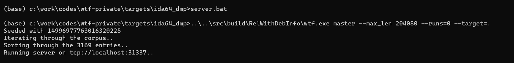
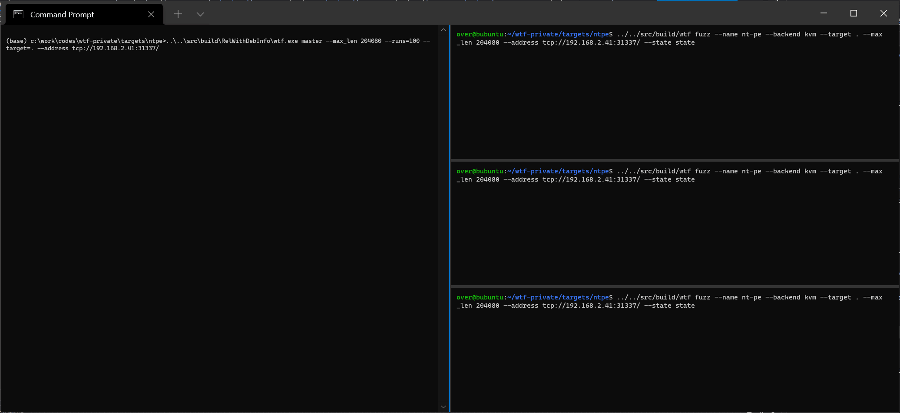

# what the fuzz


## Overview

**what the fuzz** or **wtf** is a distributed, code-coverage guided, customizable, cross-platform snapshot-based fuzzer designed for attacking user and or kernel-mode targets running on Microsoft Windows. Execution of the target can be done inside an emulator with [bochscpu](https://github.com/yrp604/bochscpu) (slowest, most precise), inside a Windows VM with the [Windows Hypervisor Platform APIs](https://docs.microsoft.com/en-us/virtualization/api/hypervisor-platform/hypervisor-platform) or inside a Linux VM with [KVM APIs](https://www.kernel.org/doc/html/latest/virt/kvm/api.html) (fastest).

<p align='center'>

</p>

It uncovered memory corruption vulnerabilities in a wide range of softwares: [IDA Pro](https://hex-rays.com/IDA-pro/), a popular [AAA game](https://en.wikipedia.org/wiki/AAA_%28video_game_industry%29), the [Windows kernel](https://microsoft.fandom.com/wiki/Architecture_of_Windows_NT), [HEVD](https://github.com/hacksysteam/HackSysExtremeVulnerableDriver/issues/42) secure mode, etc.

Compiled binaries are available from the [CI artifacts](https://github.com/0vercl0k/wtf/actions/workflows/wtf.yml) for both Windows & Linux or from the [Release](https://github.com/0vercl0k/wtf/releases) section.

Special thanks to [@yrp604](https://github.com/yrp604) for providing valuable inputs throughout the project and [@masthoon](https://github.com/masthoon) for suggesting to write a demo targeting [HEVD](https://github.com/hacksysteam/HackSysExtremeVulnerableDriver) secure mode.

## How it works

XXX: TODO.

Taking a crash-dump using [bdump.js](https://github.com/yrp604/bdump):

```
kd> .scriptload c:\\work\\codes\\bdump\\bdump.js
[bdump] Usage: !bdump "C:\\path\\to\\dump"
[bdump] Usage: !bdump_full "C:\\path\\to\\dump"
[bdump] Usage: !bdump_active_kernel "C:\\path\\to\\dump"
[bdump] This will create a dump directory and fill it with a memory and register files
[bdump] NOTE: you must include the quotes and escape the backslashes!
JavaScript script successfully loaded from 'c:\work\codes\bdump\bdump.js'

kd> !bdump_active_kernel "c:\\work\\codes\\wtf\\targets\\hevd\\state"
[bdump] creating dir...
[bdump] saving regs...
[bdump] register fixups...
[bdump] don't know how to get mxcsr_mask or fpop, setting to zero...
[bdump]
[bdump] don't know how to get avx registers, skipping...
[bdump]
[bdump] tr.base is not cannonical...
[bdump] old tr.base: 0x7375c000
[bdump] new tr.base: 0xfffff8047375c000
[bdump]
[bdump] setting flag 0x2000 on cs.attr...
[bdump] old cs.attr: 0x2fb
[bdump] new cs.attr: 0x22fb
[bdump]
[bdump] rip and gs don't match kernel/user, swapping...
[bdump] rip: 0x7ff6f5bb111e
[bdump] new gs.base: 0xdfd9621000
[bdump] new kernel_gs_base: 0xfffff8046b6f3000
[bdump]
[bdump] non-zero IRQL in usermode, resetting to zero...
[bdump] saving mem, get a coffee or have a smoke, this will probably take around 10-15 minutes...
[bdump] Creating c:\work\codes\wtf\targets\hevd\state\mem.dmp - Active kernel and user memory bitmap dump
[bdump] Collecting pages to write to the dump. This may take a while.
[bdump] 0% written.
[...]
[bdump] 95% written. 1 sec remaining.
[bdump] Wrote 1.5 GB in 23 sec.
[bdump] The average transfer rate was 64.7 MB/s.
[bdump] Dump successfully written
[bdump] done!
@$bdump_active_kernel("c:\\work\\codes\\wtf\\targets\\hevd\\state")
```

## Usage

XXX: TODO.

### Prepare the fuzzer module

wtf needs the user to provide three different callbacks:

1. An initialization callback ([Init_t](https://github.com/0vercl0k/wtf/blob/main/src/wtf/targets.h#L13)) that is called by wtf before starting the fuzzing job.
```c++
using Init_t = bool (*)(const Options_t &, const CpuState_t &);
```
2. An insert-testcase callback ([InsertTestcase_t](https://github.com/0vercl0k/wtf/blob/main/src/wtf/targets.h#L14)) that is called by wtf with a test-case to insert into your target.
```c++
using InsertTestcase_t = bool (*)(const uint8_t *, const size_t);
```
3. A restore callback ([Restore_t](https://github.com/0vercl0k/wtf/blob/main/src/wtf/targets.h#L15)) that is called by wtf after running a test-case.
```c++
using Restore_t = bool (*)();
```

To create a target module, you create a `.cc` file and you register the module by instantiating [Target_t](https://github.com/0vercl0k/wtf/blob/main/src/wtf/targets.h#L12):

```c++
bool InsertTestcase(const uint8_t *Buffer, const size_t BufferSize) {
  return true;
}

bool Init(const Options_t &Opts, const CpuState_t &) { return true; }

bool Restore() { return true; }

//
// Register the target.
//

Target_t Dummy("dummy", Init, InsertTestcase, Restore);
```

Recompile wtf and you will be able to `--name` to tell wtf which modules to use.

Once the module is ready it is then recommended to create a directory in `targets/dummy`. In a target directory you should find:

- a `state` directory. 
- an `input` directory,
- an `output` directory,
- a `crash` directory.

XXX: TODO.

### Starting a server node

The server is basically the brain and keeps track of all the state: it keeps track of the aggregated code-coverage, it keeps track of the corpus and it generates the test-cases. As a result, it needs to know a few things:

1. The address (`--address`) it listens on; the default is `tcp://localhost:31337`,
2. The number of mutations (`--runs`) to perform,
3. The target directory (`--target`) where the server finds the `input` (by default `<target>/inputs`) corpus, the `output` (by default `<target>/outputs`) minset and the `crashes` directory (by default `<target>/crashes`).

The user can also choose to override the `input` / `output` / `crashes` directory by using `--input` / `--output` / `--crashes`.

<p align='center'>

</p>

### Connecting client nodes

<p align='center'>

</p>

XXX: TODO

### Generating execution traces

<p align='center'>

</p>

XXX: TODO

### Minsetting a corpus

<p align='center'>

</p>

XXX: TODO

### Running a test-case

<p align='center'>

</p>

XXX: TODO

## Build

The [CI](https://github.com/0vercl0k/wtf/blob/main/.github/workflows/wtf.yml) builds wtf on Ubuntu 20.04 using [clang++-11](https://clang.llvm.org/) / [g++-11](https://gcc.gnu.org/gcc-11/) and on Windows using Microsoft's [Visual Studio 2019](https://visualstudio.microsoft.com/vs/community/).

To build it yourself you need to start a *Visual Studio Developper Command Prompt* and either run [build-release.bat](https://github.com/0vercl0k/wtf/blob/main/src/build/build-release.bat) which uses the [Ninja](https://ninja-build.org/) generator or [build-release-msvc.bat](https://github.com/0vercl0k/wtf/blob/main/src/build/build-release-msvc.bat) to generate a Visual Studio solution file:

```
(base) wtf\src\build>build-release.bat
[...]
[2/2] Linking CXX executable wtf.exe

(base) wtf\src\build_msvc>..\build\build-release-msvc.bat
[...]
  Finished generating code
  wtf.vcxproj -> wtf\src\build_msvc\RelWithDebInfo\wtf.exe
  Building Custom Rule wtf/src/CMakeLists.txt
```

## Authors

* Axel '[0vercl0k](https://twitter.com/0vercl0k)' Souchet
