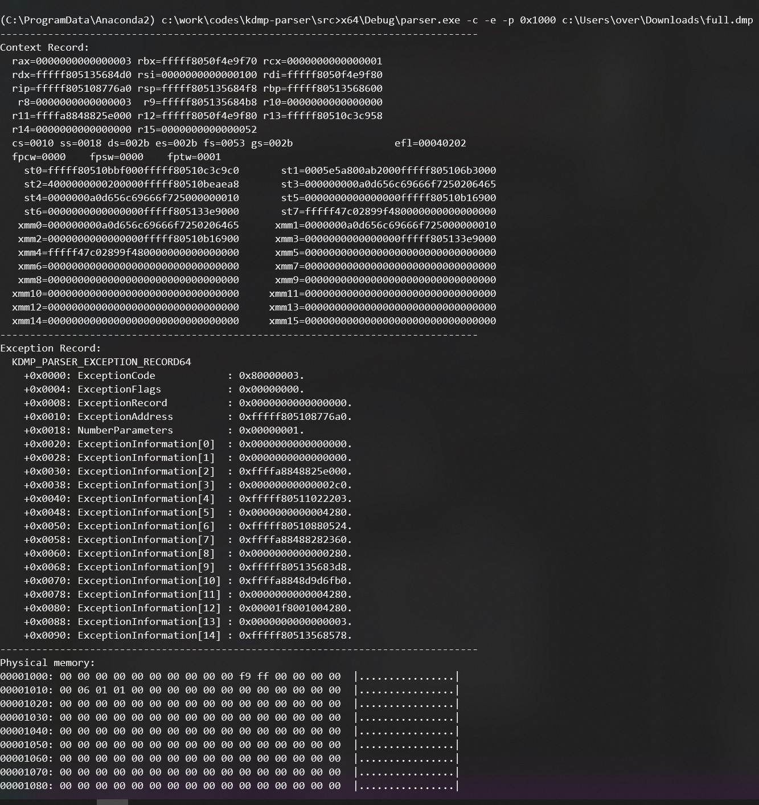

# kdmp-parser


This C++ library parses Windows kernel [full](https://docs.microsoft.com/en-us/windows-hardware/drivers/debugger/complete-memory-dump) dumps (`.dump /f` in WinDbg) as well as [BMP](https://docs.microsoft.com/en-us/windows-hardware/drivers/debugger/active-memory-dump) dumps (`.dump /ka` in WinDbg).



The library supports loading 64-bit dumps and provides read access to things like:

- The context record,
- The exception record,
- The bugcheck parameters,
- The physical memory.

Compiled binaries are available in the [releases](https://github.com/0vercl0k/kdmp-parser/releases) section.

Special thanks to:
- [yrp604](https://github.com/yrp604) for being knowledgeable about the format,
- the [rekall](https://github.com/google/rekall) project and their [Python implementation](https://github.com/google/rekall/blob/master/rekall-core/rekall/plugins/overlays/windows/crashdump.py) (most of the structures in [kdmp-parser-structs.h](https://github.com/0vercl0k/kdmp-parser/blob/master/src/kdmp-parser/kdmp-parser-structs.h) have been adapted from it).

## Python 3 bindings

The bindings allow you to: read the context, read physical memory and to do virtual memory translations:

```py
from kdmp import Dump, FullDump, BMPDump

dmp = Dump(sys.argv[2])
assert(dmp.type() == FullDump or dmp.type() == BMPDump)

ctx = dmp.context()
dtb = ctx['dtb'] & ~0xfff # remove PCID

assert(ctx['rip'] == 0xfffff805108776a0)
assert(dtb == 0x6d4000)

page = dmp.get_physical_page(0x5000)
assert(page[0x34:0x38] == b'MSFT')

assert(dmp.virt_translate(0xfffff78000000000) == 0x0000000000c2f000)
assert(dmp.virt_translate(0xfffff80513370000) == 0x000000003d555000)

assert(dmp.get_virtual_page(0xfffff78000000000) == dmp.get_physical_page(0x0000000000c2f000))
assert(dmp.get_virtual_page(0xfffff80513370000) == dmp.get_physical_page(0x000000003d555000))

v = 0xfffff80513568000
assert(dmp.get_virtual_page(v) == dmp.get_physical_page(dmp.virt_translate(v)))
```

## Parser

The `parser.exe` application is able to dump various information about the dump file: exception record, context record, etc.

```text
kdmp-parser\src>x64\Debug\parser.exe -c -e -p 0x1000 full.dmp
--------------------------------------------------------------------------------
Context Record:
  rax=0000000000000003 rbx=fffff8050f4e9f70 rcx=0000000000000001
  rdx=fffff805135684d0 rsi=0000000000000100 rdi=fffff8050f4e9f80
  rip=fffff805108776a0 rsp=fffff805135684f8 rbp=fffff80513568600
   r8=0000000000000003  r9=fffff805135684b8 r10=0000000000000000
  r11=ffffa8848825e000 r12=fffff8050f4e9f80 r13=fffff80510c3c958
  r14=0000000000000000 r15=0000000000000052
  cs=0010 ss=0018 ds=002b es=002b fs=0053 gs=002b                 efl=00040202
  fpcw=0000    fpsw=0000    fptw=0001
    st0=fffff80510bbf000fffff80510c3c9c0       st1=0005e5a800ab2000fffff805106b3000
    st2=4000000000200000fffff80510beaea8       st3=000000000a0d656c69666f7250206465
    st4=0000000a0d656c69666f725000000010       st5=0000000000000000fffff80510b16900
    st6=0000000000000000fffff805133e9000       st7=fffff47c02899f480000000000000000
   xmm0=000000000a0d656c69666f7250206465      xmm1=0000000a0d656c69666f725000000010
   xmm2=0000000000000000fffff80510b16900      xmm3=0000000000000000fffff805133e9000
   xmm4=fffff47c02899f480000000000000000      xmm5=00000000000000000000000000000000
   xmm6=00000000000000000000000000000000      xmm7=00000000000000000000000000000000
   xmm8=00000000000000000000000000000000      xmm9=00000000000000000000000000000000
  xmm10=00000000000000000000000000000000     xmm11=00000000000000000000000000000000
  xmm12=00000000000000000000000000000000     xmm13=00000000000000000000000000000000
  xmm14=00000000000000000000000000000000     xmm15=00000000000000000000000000000000
--------------------------------------------------------------------------------
Exception Record:
  KDMP_PARSER_EXCEPTION_RECORD64
    +0x0000: ExceptionCode            : 0x80000003.
    +0x0004: ExceptionFlags           : 0x00000000.
    +0x0008: ExceptionRecord          : 0x0000000000000000.
    +0x0010: ExceptionAddress         : 0xfffff805108776a0.
    +0x0018: NumberParameters         : 0x00000001.
    +0x0020: ExceptionInformation[0]  : 0x0000000000000000.
    +0x0028: ExceptionInformation[1]  : 0x0000000000000000.
    +0x0030: ExceptionInformation[2]  : 0xffffa8848825e000.
    +0x0038: ExceptionInformation[3]  : 0x00000000000002c0.
    +0x0040: ExceptionInformation[4]  : 0xfffff80511022203.
    +0x0048: ExceptionInformation[5]  : 0x0000000000004280.
    +0x0050: ExceptionInformation[6]  : 0xfffff80510880524.
    +0x0058: ExceptionInformation[7]  : 0xffffa88488282360.
    +0x0060: ExceptionInformation[8]  : 0x0000000000000280.
    +0x0068: ExceptionInformation[9]  : 0xfffff805135683d8.
    +0x0070: ExceptionInformation[10] : 0xffffa8848d9d6fb0.
    +0x0078: ExceptionInformation[11] : 0x0000000000004280.
    +0x0080: ExceptionInformation[12] : 0x00001f8001004280.
    +0x0088: ExceptionInformation[13] : 0x0000000000000003.
    +0x0090: ExceptionInformation[14] : 0xfffff80513568578.
--------------------------------------------------------------------------------
Physical memory:
00001000: 00 00 00 00 00 00 00 00 00 00 f9 ff 00 00 00 00  |................|
00001010: 00 06 01 01 00 00 00 00 00 00 00 00 00 00 00 00  |................|
00001020: 00 00 00 00 00 00 00 00 00 00 00 00 00 00 00 00  |................|
00001030: 00 00 00 00 00 00 00 00 00 00 00 00 00 00 00 00  |................|
00001040: 00 00 00 00 00 00 00 00 00 00 00 00 00 00 00 00  |................|
00001050: 00 00 00 00 00 00 00 00 00 00 00 00 00 00 00 00  |................|
00001060: 00 00 00 00 00 00 00 00 00 00 00 00 00 00 00 00  |................|
00001070: 00 00 00 00 00 00 00 00 00 00 00 00 00 00 00 00  |................|
00001080: 00 00 00 00 00 00 00 00 00 00 00 00 00 00 00 00  |................|
00001090: 00 00 00 00 00 00 00 00 00 00 00 00 00 00 00 00  |................|
000010a0: 00 00 00 00 00 00 00 00 00 a0 87 00 00 00 00 00  |................|
000010b0: ff ff ff ff ff ff ff ff 00 00 60 11 05 f8 ff ff  |..........`.....|
000010c0: 00 90 2f 00 00 00 00 00 ff ff ff ff 03 80 ff ff  |../.............|
000010d0: f8 00 00 c0 c1 f7 ff ff 00 00 00 00 03 00 00 00  |................|
000010e0: f8 00 00 c0 c1 f7 ff ff 00 00 00 00 03 00 00 00  |................|
000010f0: 00 00 00 00 00 00 00 00 70 37 01 c0 c1 f7 ff ff  |........p7......|
...
```

## Building

You can build it yourself using `builder.py` or [CMake](https://cmake.org/) on either [Windows](#Windows) or [Linux](#Linux). More detailed information are described in the below sections.

### Linux

You can build it via the command line using `builder.py` or by invoking `cmake` yourself:

```text
over@oof:/kdmp-parser$ python3 builder.py -h
usage: Build and run test [-h] [--run-tests]
                          [--configuration {Debug,RelWithDebInfo}]
                          [--arch {x64,x86}]

optional arguments:
  -h, --help            show this help message and exit
  --run-tests
  --configuration {Debug,RelWithDebInfo}
  --arch {x64,x86}

over@oof:/kdmp-parser$ python3 builder.py --configuration Debug
...
[6/6] Linking CXX executable ../../bin/linx64-Debug/testapp
[6/6] Linking CXX executable ../../bin/linx86-Debug/testapp

over@oof:/kdmp-parser/$ cd build/
over@oof:/kdmp-parser/build$ mkdir linx64-RelWithDebInfo/
over@oof:/kdmp-parser/build$ cd linx64-RelWithDebInfo/
over@oof:/kdmp-parser/build/linx64-RelWithDebInfo$ cmake -DCMAKE_BUILD_TYPE=RelWithDebInfo ../../ && cmake --build .
```

### Windows

You can build it using [Visual Studio 2019](https://visualstudio.microsoft.com/downloads/) by either using the *Open the folder* option or via the command line using `builder.py` /  `cmake` directly:

```text
kdmp-parser>python builder.py --configuration Debug
...
[6/6] Linking CXX executable ..\..\bin\x64-Debug\testapp.exe
[6/6] Linking CXX executable ..\..\bin\x86-Debug\testapp.exe

kdmp-parser>cd build
kdmp-parser\build>mkdir x64-RelWithDebInfo
kdmp-parser\build>cd x64-RelWithDebInfo
kdmp-parser\build\x64-RelWithDebInfo>cmake -DCMAKE_BUILD_TYPE=RelWithDebInfo -GNinja ..\..\
-- The C compiler identification is MSVC 19.25.28614.0
-- The CXX compiler identification is MSVC 19.25.28614.0
-- Check for working C compiler: C:/Program Files (x86)/Microsoft Visual Studio/2019/Community/VC/Tools/MSVC/14.25.28610/bin/Hostx64/x64/cl.exe
-- Check for working C compiler: C:/Program Files (x86)/Microsoft Visual Studio/2019/Community/VC/Tools/MSVC/14.25.28610/bin/Hostx64/x64/cl.exe -- works
-- Detecting C compiler ABI info
-- Detecting C compiler ABI info - done
-- Detecting C compile features
-- Detecting C compile features - done
-- Check for working CXX compiler: C:/Program Files (x86)/Microsoft Visual Studio/2019/Community/VC/Tools/MSVC/14.25.28610/bin/Hostx64/x64/cl.exe
-- Check for working CXX compiler: C:/Program Files (x86)/Microsoft Visual Studio/2019/Community/VC/Tools/MSVC/14.25.28610/bin/Hostx64/x64/cl.exe -- works
-- Detecting CXX compiler ABI info
-- Detecting CXX compiler ABI info - done
-- Detecting CXX compile features
-- Detecting CXX compile features - done
-- Configuring done
-- Generating done
-- Build files have been written to: kdmp-parser/build/x64-RelWithDebInfo

kdmp-parser\build\x64-RelWithDebInfo>cmake --build .
[6/6] Linking CXX executable ..\..\bin\x64-RelWithDebInfo\parser.exe
```

# Authors

* Axel '[@0vercl0k](https://twitter.com/0vercl0k)' Souchet

With contributions from:
  - [@masthoon](https://github.com/masthoon).
